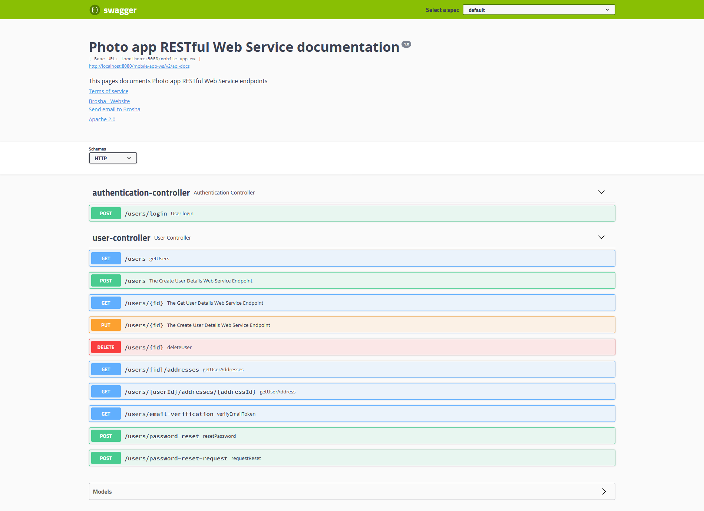

# SpringBootApp

SpringBootApp is a project created during a course from [Udemy](https://www.udemy.com/course/restful-web-service-with-spring-boot-jpa-and-mysql/). An idea of this course is creating RESTful Web Service application with Java, Spring MVC, Spring Boot and Spring Data JPA.

The Project consists of 2 parts - RESTful Web Service and email verification service. It was created a Swagger UI documentation for Web Service.

## Description

http://localhost:8080/mobile-app-ws/swagger-ui.html

Features:

- User sign-up and User sign-in

- Email verification using Amazon AWS Simple Email Service(SES)

- Password Reset

- Get user details API call 

- Get list of users API call and implement Pagination

- Update user details and Delete user details API calls 

- Implementing Security of Web Service endpoints with Spring Security 

## Technologies Used

- Spring Boot
- Spring MVC
- Spring Security
- MySQL server
- Apache Tomcat
- Maven
- H2 in-memory database for testing
- JUnit 5
- Rest Assured framework
- Mockito
- SpringFox Swagger UI
- Amazon AWS Simple Email Service(SES)
- ModelMapper
